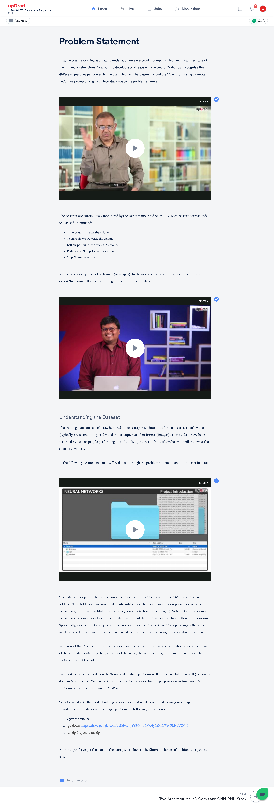
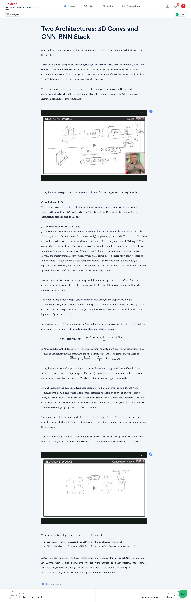
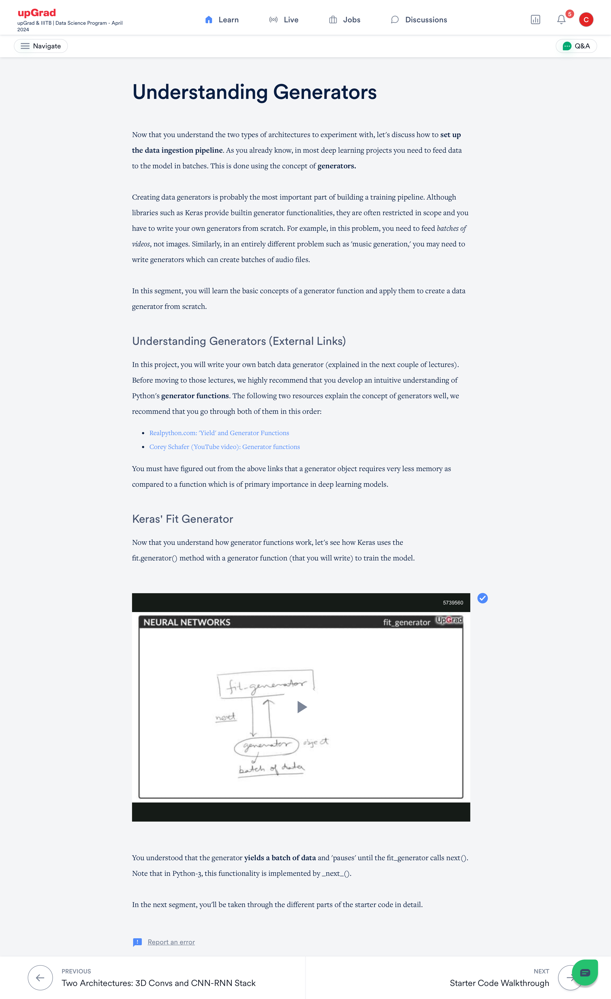
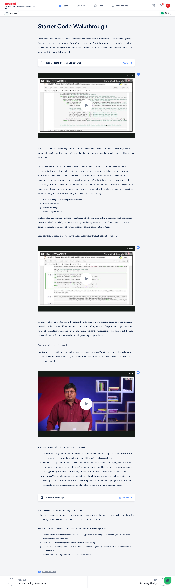
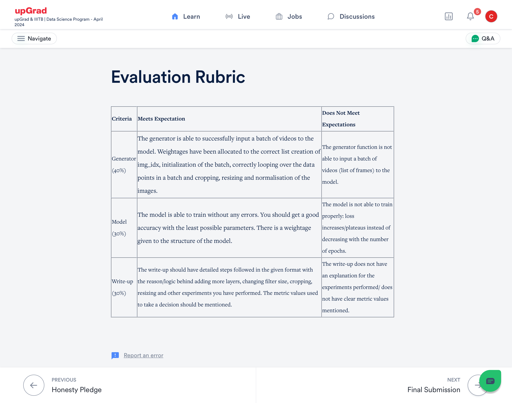

# Adv-ML-DS-NeuralNkt-GestureRec

# 📺 Gesture Recognition for Smart TV Control

## 🧠 Problem Statement
Develop a gesture recognition feature for smart TVs that allows users to control the device without a remote. The system uses a webcam to detect **five gestures**, each mapped to a specific command:

- 👍 **Thumbs Up**: Increase volume  
- 👎 **Thumbs Down**: Decrease volume  
- 👈 **Left Swipe**: Rewind 10 seconds  
- 👉 **Right Swipe**: Forward 10 seconds  
- ✋ **Stop**: Pause playback  

Each gesture is captured in a **video of 30 frames**.

---

## 📦 Dataset Overview

- **Structure**:  
  - Videos are stored in folders (`train`, `val`)  
  - Each video is a subfolder with 30 image frames  
  - CSV files provide metadata: folder name, gesture name, label (0–4)

- **Image Dimensions**:  
  - Vary across videos: either `360x360` or `120x160`  
  - Requires **preprocessing** to standardize input sizes

---

## 🏗️ Model Architectures

### 1. **Conv2D + RNN Stack**
- **Step 1**: CNN extracts feature vectors from each frame  
- **Step 2**: RNN (e.g., GRU or LSTM) processes the sequence  
- **Output**: Softmax classification over 5 gesture classes  
- **Tip**: Use **transfer learning** for CNN; GRU preferred for efficiency

### 2. **Conv3D Network**
- Treats video as a 4D tensor: `(height x width x depth) x channels`  
- Example: 30 RGB frames of `100x100` → shape `(100x100x30)x3`  
- **3D Filter**: `(fxfxf)xchannels` (e.g., `2x2x2x3`)  
- **Output Shape**:  
  - For input `(100x100x7)x3` and filter `2x2x2x3` → output `(99x99x6)`  
  - With 24 filters → output shape becomes `(99x99x6)x24`  
- **Trainable Parameters**:  
  - Each filter: `8 weights x 3 channels + 1 bias = 25`  
  - Total for 24 filters: `25 x 24 = 600`

---

## 🔄 Data Ingestion Pipeline

### 🧬 Custom Generators
- Required to feed **video batches** (not single images)  
- Built using Python's `yield` and generator functions  
- More memory-efficient than traditional functions

### 🔧 Keras Integration
- Use `fit_generator()` to train model with custom generator  
- Generator yields batches and pauses until `next()` is called

---

## 📥 Getting Started

# Download and unzip dataset
https://drive.google.com/uc?id=1ehyrYBQ5rbQQe6yL4XbLWe3FMvuVUGiL
unzip Project_data.zip

  

  

  

  

  

