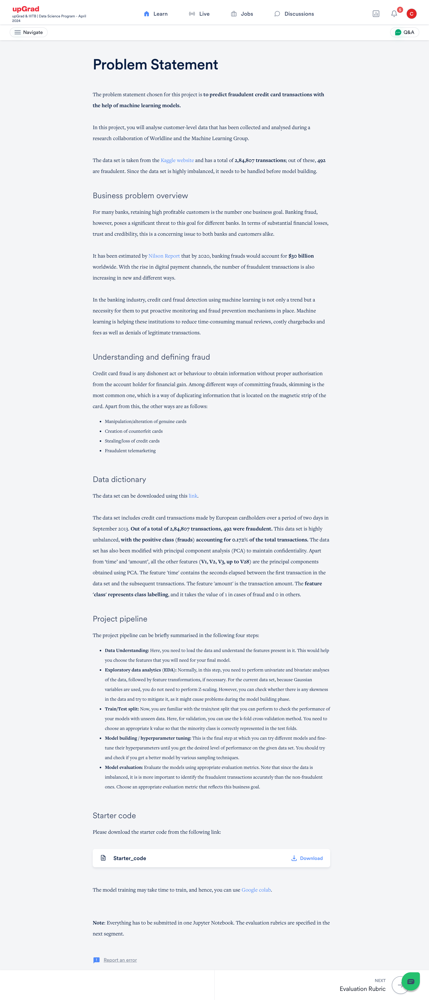

# DS-Capstone-CreditCardFraudDet

# 🧠 Project Summary: Credit Card Fraud Detection

## 🎯 Problem Statement
Predict fraudulent credit card transactions using machine learning models based on a dataset from Worldline and the Machine Learning Group.

## 📊 Dataset Overview
- **Source**: Kaggle  
- **Total transactions**: 284,807  
- **Fraudulent transactions**: 492 (≈0.172%)  
- **Features**:  
  - `Time`: Seconds since first transaction  
  - `Amount`: Transaction amount  
  - `Class`: Target label (1 = fraud, 0 = non-fraud)  
  - `V1` to `V28`: PCA-transformed components  
- **Challenge**: Highly imbalanced data

## 💼 Business Context
- Fraud threatens banks' ability to retain profitable customers.
- Estimated global fraud losses: $30 billion by 2020 (Nilson Report).
- Machine learning enables proactive fraud detection, reducing manual reviews, chargebacks, and false declines.

## 🕵️‍♂️ Types of Credit Card Fraud
- Skimming (most common)
- Card manipulation or alteration
- Counterfeit card creation
- Theft or loss of cards
- Fraudulent telemarketing

## 🔁 Project Pipeline
1. **Data Understanding**  
   - Load and explore features  
   - Select relevant features for modeling  

2. **Exploratory Data Analysis (EDA)**  
   - Univariate and bivariate analysis  
   - Address skewness if present  
   - No Z-scaling needed due to Gaussian variables  

3. **Train/Test Split**  
   - Use k-fold cross-validation  
   - Ensure minority class is represented  

4. **Model Building & Hyperparameter Tuning**  
   - Try multiple models  
   - Apply sampling techniques  
   - Tune hyperparameters  

5. **Model Evaluation**  
   - Use metrics that prioritize fraud detection  
   - Focus on precision, recall, F1-score over accuracy  

## 🧰 Tools & Resources
- Starter code available for download  
- Recommended platform: Google Colab  
- Final submission: One Jupyter Notebook

  

- Dataset Link: https://www.kaggle.com/mlg-ulb/creditcardfraud