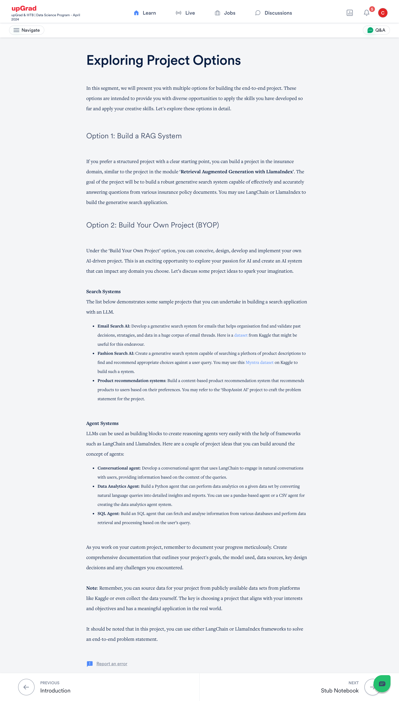
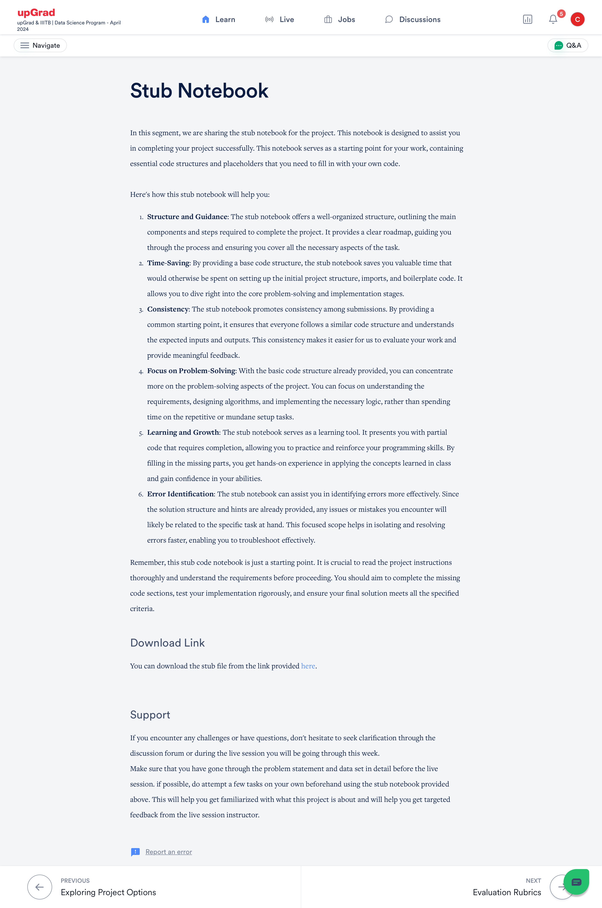
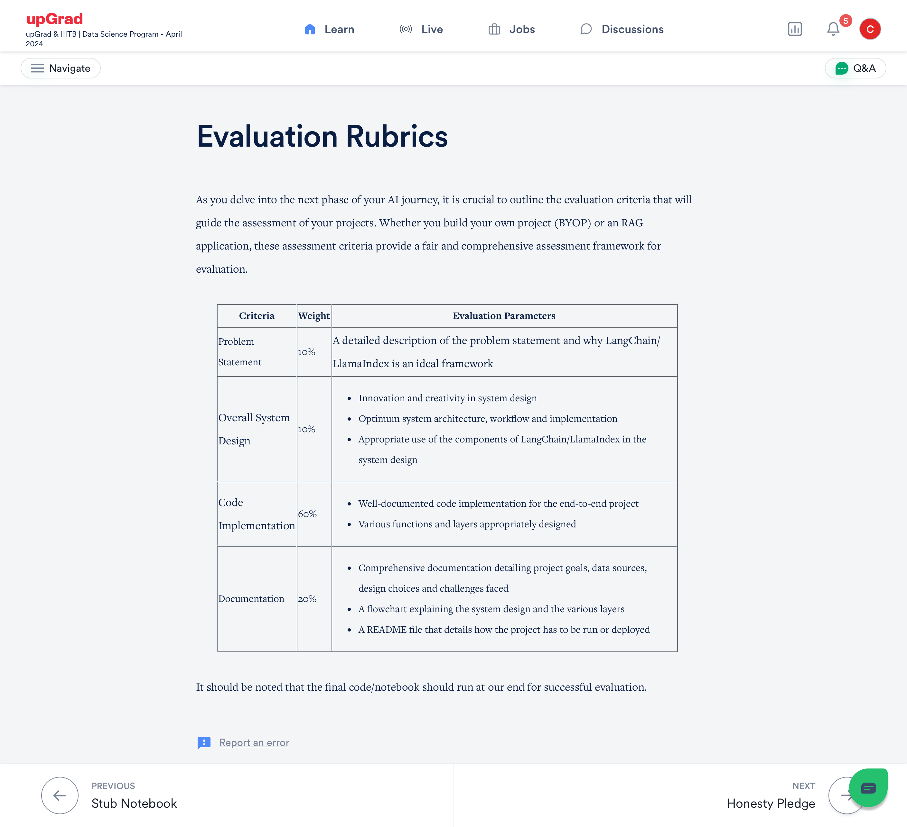

# GenAI-DL-HelpmateAI

### Introduction  
  
This document covers details on How to run the jupyter notebook  
---  
### Steps  
   
  
1. Upload the jupyter notebook (ipynb) to your Google Drive, and open it using Google Colab
2. Access the insurance documents mentioned in the jupyter notebook and upload them to your google drive.
3. Ensure the chatgpt keys are also made available
4. In the jupyter notebook (ipynb), update the directory name that points to the chatgpt key and insurance pdf files. 
---  

# 🧠 Project Options Overview

You are offered two main paths to build an end-to-end AI project using **LangChain** or **LlamaIndex**:

## 🔹 Option 1: Build a RAG System
- **Domain**: Insurance
- **Goal**: Create a generative search system that answers queries from insurance policy documents
- **Tools**: LangChain or LlamaIndex

## 🔹 Option 2: Build Your Own Project (BYOP)
- Design and implement a custom AI project in any domain
- Suggested themes:

### 🔍 Search Systems
- **Email Search AI**: Search and summarize organizational email threads (Dataset https://www.kaggle.com/datasets/marawanxmamdouh/email-thread-summary-dataset)  
- **Fashion Search AI**: Recommend products based on user queries  (Dataset https://www.kaggle.com/datasets/djagatiya/myntra-fashion-product-dataset)
- **Product Recommendation System**: Suggest items based on user preferences  (Can use shop assist ai)

### 🤖 Agent Systems
- **Conversational Agent**: Chatbot that responds contextually  
- **Data Analytics Agent**: Converts natural language queries into data insights  
- **SQL Agent**: Retrieves and analyzes data from databases  

> 💡 Tip: Use public datasets (e.g., Kaggle) or collect your own. Document your process thoroughly.

---

# 📓 Stub Notebook Support

A starter notebook is provided to help you build your project efficiently.

## ✅ Benefits
- **Structured roadmap** and code skeleton  
- **Saves setup time**  
- **Promotes consistency** across submissions  
- **Focuses on problem-solving** and learning  
- **Helps identify and fix errors** quickly  

> 📥 Download the stub notebook from the provided link to begin. https://drive.google.com/file/d/1OjChKIyouZF1K3OrfFscHrpNBwilxpRj/view?usp=drive_link

  

  

  

