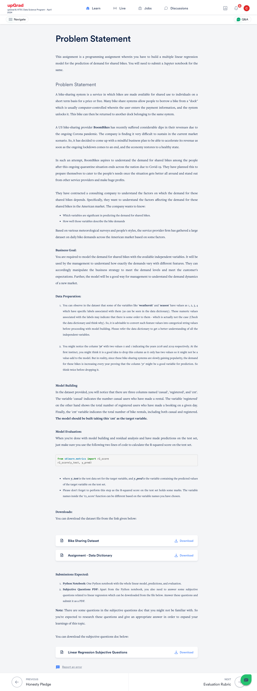

# Machine Learning 1 - Linear Regression - Bike Sharing

# 🚲 Bike Demand Prediction Using Multiple Linear Regression

## 📘 Overview
This project aims to build a **Multiple Linear Regression** model to predict the daily demand for shared bikes. The dataset is provided by BoomBikes, a U.S.-based bike-sharing company, which seeks to understand rental patterns and optimize its business strategy in the wake of the COVID-19 pandemic.

## 🧠 Problem Statement
BoomBikes experienced a significant drop in revenue during the pandemic. To prepare for post-lockdown recovery, the company wants to identify key factors that influence bike rental demand. This model will help forecast demand and guide strategic decisions in marketing, operations, and expansion.

## 🎯 Business Objective
- Identify significant predictors of bike demand.
- Quantify the relationship between features and rental counts.
- Enable data-driven planning for future operations and market expansion.

## 📊 Dataset Description
The dataset includes daily rental records with variables such as:
- **Season**, **Weather Situation**, **Holiday**, **Working Day**
- **Temperature**, **Humidity**, **Windspeed**
- **Casual**, **Registered**, and **Total Count (`cnt`)** of rentals

> Note: Variables like `season` and `weathersit` are encoded numerically but represent categorical data. These are converted to string labels during preprocessing.

## 🛠️ Project Structure
- `Bike_Demand_Prediction.ipynb`: Jupyter notebook containing the full workflow:
  - Data cleaning and preprocessing
  - Feature engineering
  - Model building and training
  - Residual analysis and evaluation
- `Linear_Regression_Subjective_Answers.pdf`: Answers to theoretical questions related to linear regression.

## 📈 Model Details
- **Target Variable**: `cnt` (total number of rentals per day)
- **Model Type**: Multiple Linear Regression
- **Evaluation Metric**: R-squared score (`r2_score` from `sklearn.metrics`)

## 🧪 Evaluation
Model performance is assessed using:
```python```


<p align="center">
  
</p>
<p align="center">
  
</p>
